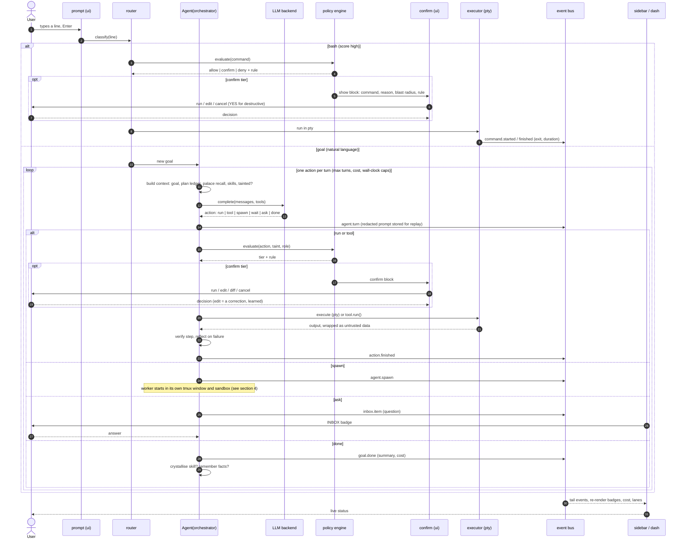
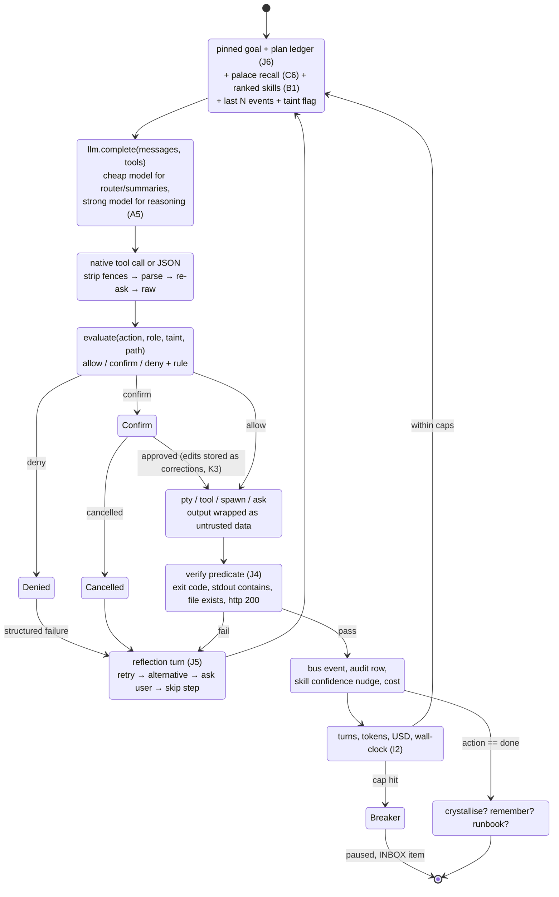
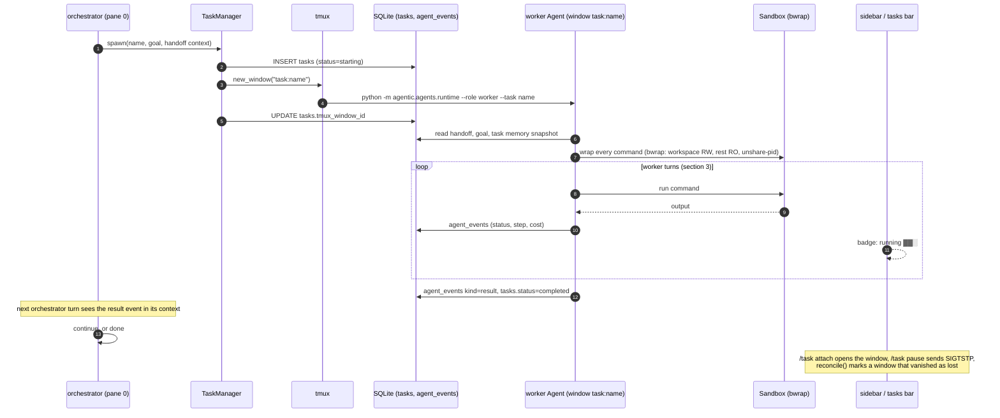
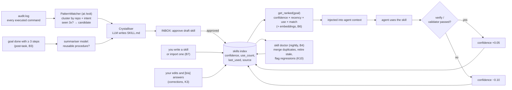
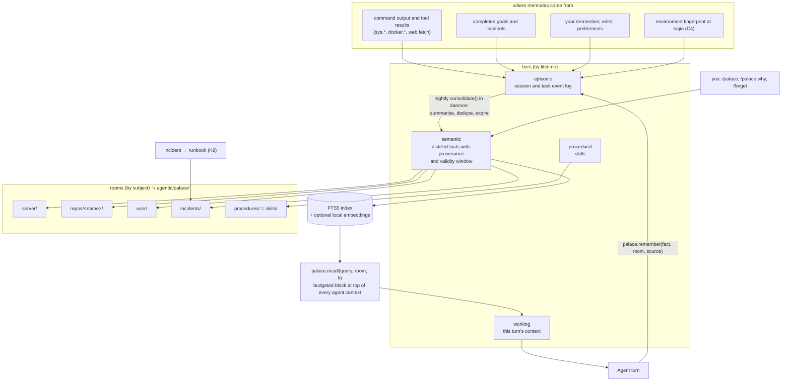
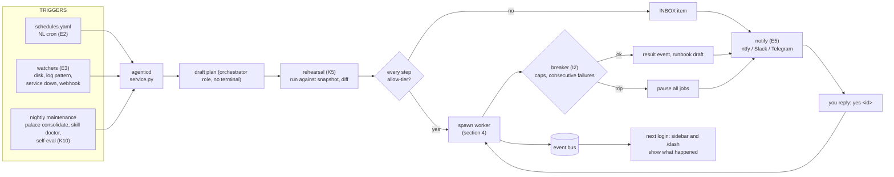
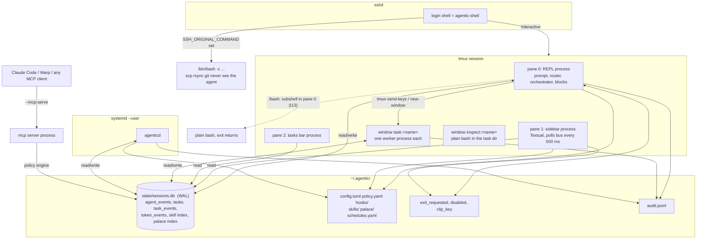

# AgenticOS v4 Architecture: how a request moves through the system

This document traces the system end to end, one diagram per concern. Solid boxes exist today (v0.3); dashed boxes are v4 targets from [vision.md](vision.md) and [structure.md](structure.md). Feature IDs in parentheses point at the catalog.

Diagrams are Mermaid and render on GitHub. For the current (v0.3) walkthrough with hand-drawn diagrams see [architecture.md](architecture.md); for every table and field see [architecture-reference.md](architecture-reference.md).

---

## 1. The big picture: layers and what talks to what

Lower layers never import higher ones. Agents never touch the UI; they publish events and the UI renders them. This one rule is what lets the daemon run agents with no terminal attached and keeps the REPL responsive while agents work.

```mermaid
flowchart TB
    subgraph APP["app  (composition root)"]
        MAIN["main.py<br/>SSH bypass, bootstrap"]
        REPL["repl.py<br/>read, builtin?, route, dispatch"]
        BUILTINS["builtins/<br/>/task /skill /clip /mcp /schedule /palace ..."]
    end

    subgraph UI["ui  (everything a human sees)"]
        PROMPT["prompt/<br/>prompt_toolkit, ghost text"]
        BLOCKS["blocks.py<br/>one block per action"]
        CONFIRM["confirm.py<br/>run / edit / diff / cancel"]
        SIDEBAR["sidebar/<br/>Textual, pane 1"]
        DASH["dash/<br/>full-screen command center"]
        TMUX["tmux/<br/>panes, key IPC"]
    end

    subgraph AGENTS["agents  (the runtime)"]
        RUNTIME["runtime.py<br/>Agent(role)"]
        ROLES["roles/<br/>orchestrator, worker, reviewer"]
        ACTIONS["actions.py<br/>run spawn wait ask tool done"]
        ROUTER["router.py<br/>bash / goal / ambiguous"]
        PLANNER["planner.py<br/>plan arrays, DAGs"]
        MANAGER["manager.py<br/>spawn pause kill attach"]
        SANDBOX["sandbox.py<br/>bwrap or bash wrapper"]
    end

    subgraph TOOLS["tools  (J1)"]
        REGISTRY["registry.py"]
        WEB["web.search / fetch"]
        FS["fs.read / patch / search"]
        SYS["sys.* docker.* git.* logs.*"]
        PY["py.run"]
    end

    subgraph SKILLS["skills"]
        SINDEX["index.py<br/>confidence ranking"]
        SLOADER["loader.py"]
        SWATCH["watcher.py<br/>pattern detection"]
        SCRYST["crystalliser.py"]
    end

    subgraph MEMORY["memory  (C6 Memory Palace)"]
        PALACE["palace.py<br/>recall remember forget consolidate"]
        ROOMS["rooms: server repos user incidents procedures"]
        SESSION["session.py<br/>compression"]
    end

    subgraph POLICY["policy"]
        ENGINE["engine.py<br/>allow / confirm / deny"]
        HOOKS["hooks.py<br/>pre_command post_command pre_spawn"]
        TAINT["blast_radius.py + taint"]
        SECRETS["secrets.py<br/>redaction, $SECRET broker"]
    end

    subgraph LLM["llm"]
        BASE["base.py<br/>LLMBackend, contracts"]
        BACKENDS["ollama / openai / anthropic"]
        PROMPTS["prompts/*.md"]
    end

    subgraph CORE["core"]
        CONFIG["config/<br/>layered TOML"]
        BUS["events/bus.py<br/>agent_events (SQLite)"]
        DB["db.py<br/>WAL, migrations"]
        EXEC["executor.py<br/>PtyProcessUnicode, cd"]
        AUDIT["audit.py<br/>provenance ledger"]
    end

    subgraph DAEMON["daemon  (E1)"]
        SERVICE["service.py agenticd"]
        SCHED["schedule.py NL cron"]
        WATCHERS["watchers.py"]
        NOTIFY["notify.py"]
    end

    subgraph MCP["mcp"]
        MCLIENT["client.py"]
        MSERVER["server.py --mcp-serve"]
    end

    MAIN --> REPL --> BUILTINS
    REPL --> ROUTER
    ROUTER -->|bash| ENGINE
    ROUTER -->|goal| RUNTIME
    RUNTIME --> ROLES --> ACTIONS
    ACTIONS --> ENGINE
    ACTIONS --> REGISTRY
    ACTIONS --> MANAGER --> SANDBOX
    REGISTRY --> WEB & FS & SYS & PY
    REGISTRY --> MCLIENT
    RUNTIME --> SLOADER --> SINDEX
    RUNTIME --> PALACE --> ROOMS
    RUNTIME --> BASE --> BACKENDS
    BASE --> PROMPTS
    ENGINE --> HOOKS
    ENGINE --> TAINT
    ENGINE --> EXEC
    EXEC --> AUDIT
    EXEC --> BUS
    RUNTIME --> BUS
    REGISTRY --> BUS
    BUS --> SIDEBAR & DASH & BLOCKS
    SERVICE --> SCHED & WATCHERS & NOTIFY
    SERVICE --> RUNTIME
    SERVICE --> PALACE
    SERVICE --> SINDEX
    MSERVER --> ENGINE
    MSERVER --> MANAGER
    SWATCH --> SCRYST --> SINDEX
    CONFIG -.-> APP & UI & AGENTS & POLICY & DAEMON
    DB -.-> BUS & AUDIT & SINDEX & PALACE

    classDef today fill:#e8f5e9,stroke:#2e7d32,color:#000
    classDef target fill:#fff8e1,stroke:#f9a825,stroke-dasharray:5 3,color:#000
    class MAIN,REPL,BUILTINS,PROMPT,CONFIRM,TMUX,ROUTER,PLANNER,MANAGER,SANDBOX,SINDEX,SLOADER,SWATCH,SCRYST,SESSION,SECRETS,BASE,BACKENDS,CONFIG,DB,EXEC,AUDIT today
    class BLOCKS,SIDEBAR,DASH,RUNTIME,ROLES,ACTIONS,REGISTRY,WEB,FS,SYS,PY,PALACE,ROOMS,ENGINE,HOOKS,TAINT,PROMPTS,BUS,SERVICE,SCHED,WATCHERS,NOTIFY,MCLIENT,MSERVER target
```

Green = exists in v0.3 (possibly under a different file name, see the migration table in structure.md §5). Amber dashed = v4.

---

## 2. One keystroke to one result: the request lifecycle

What happens between pressing Enter and seeing the block close. Every arrow that crosses into `policy` is a place the user can be asked; every arrow into `bus` is something the sidebar shows.

---

## 3. Inside one agent turn

The same loop runs for the orchestrator (interactive, in pane 0), for workers (background, own tmux window), and for daemon jobs (no terminal). Only the role's prompt, allowed actions and policy floor differ.

---

## 4. Spawning a sub-agent

The orchestrator hands off a self-contained goal. The worker gets its own tmux window (so you can attach and steer), its own sandbox (workspace read-write, everything else read-only), and reports back over the event bus.

---

## 5. How the shell learns: the skill loop

Two entry points feed one index. Today only the `/exit` path exists and it writes skills with no approval; v4 adds post-task crystallisation with an INBOX approval, and closes the confidence loop.

---

## 6. Memory Palace: what agents remember and how it gets there

One layer, four tiers by lifetime, rooms by subject. Everything is plain markdown on disk; SQLite only indexes it.

---

## 7. Working while you are away: the daemon

`agenticd` runs as a systemd user service. It never has a terminal, so it can only spawn workers whose every step is `allow`-tier; anything else goes to the INBOX and, if configured, to your phone.

---

## 8. Processes, panes and how they talk

There is no central server. Three kinds of processes share one SQLite file in WAL mode; that is the whole IPC story, which is why nothing blocks the prompt.

---

## 9. Reading the diagrams together

| If you want to know… | Look at |
|---|---|
| which module owns a responsibility and who may import whom | §1 |
| where the user can be asked, and where the sidebar gets its data | §2 (every arrow into *policy* and *bus*) |
| why an agent stopped, retried, or asked | §3 |
| why a task shows *lost* or how to steer a worker | §4 |
| why a skill was picked or its confidence moved | §5 |
| where a fact came from and when it expires | §6 |
| what the daemon is allowed to do alone | §7 |
| which process is doing what, and why nothing blocks | §8 |

Every one of these has a corresponding "why" command in the shell (`/why`, `/policy explain`, `/skill why`, `/palace why`, `/task replay`, `/events tail`) per the visibility principles in [structure.md §4](structure.md).
