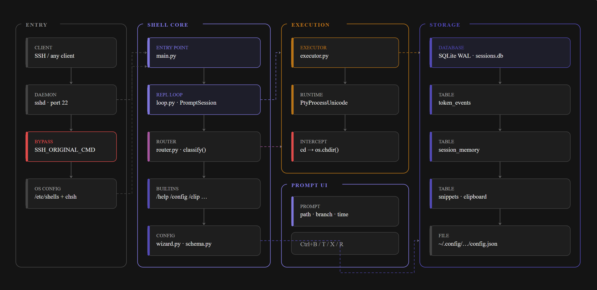
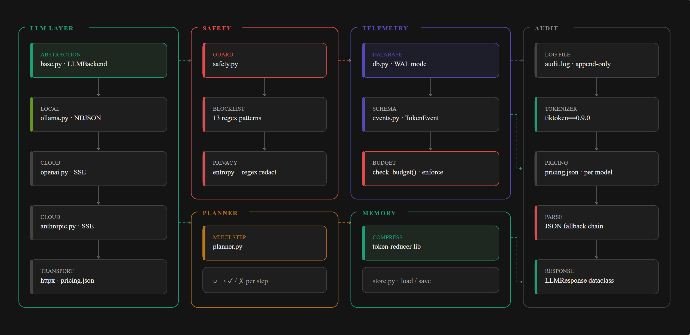
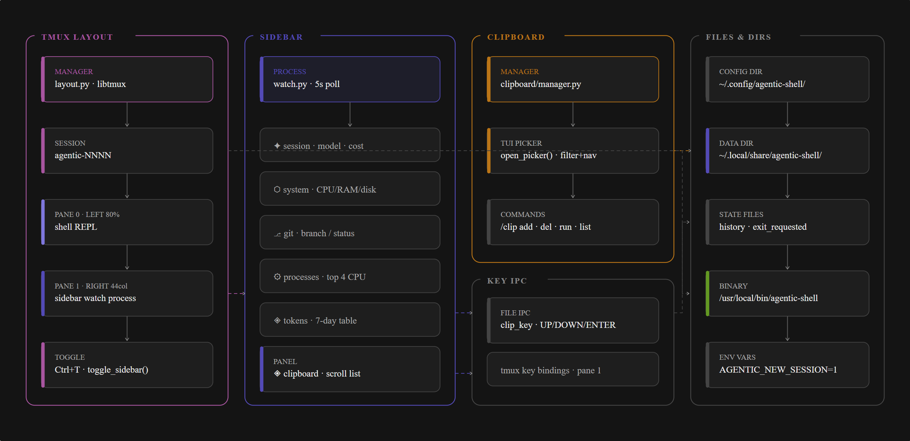

# Sable - Architecture Overview

> A Python login shell that replaces `/bin/bash` on any Linux server. SSH in. Your server understands plain English.

This document describes the full system architecture across three layers: the core shell flow, the intelligence and telemetry layer, and the sidebar, tmux layout, and clipboard system. Each layer is covered by a dedicated diagram followed by a component breakdown.

---

## Diagram 1 - Core shell flow



This diagram covers everything from SSH connection to command execution. It shows how a user's input travels from the SSH client through the entry point, into the REPL loop, gets classified by the router, and lands in the executor. Storage on the right represents the SQLite database and config file that persist across sessions.

**Containers:** Entry · Shell Core · Execution · Prompt UI · Storage

**Key paths:**

- SSH non-interactive commands (`scp`, `rsync`, `git push`) hit the `SSH_ORIGINAL_COMMAND` bypass at the very first line of `main.py` and exec directly to bash. The agentic shell is never in their path.
- Interactive logins load config, resume session context from SQLite, and enter the `prompt_toolkit` REPL loop.
- The router classifies every line as `BASH`, `AGENTIC`, or `AMBIGUOUS`. Ambiguous inputs ask the user to choose.
- All commands execute via `PtyProcessUnicode` so interactive programs (vim, htop, ssh) get a real TTY automatically.
- `cd` is intercepted before the PTY and calls `os.chdir()` directly on the Python process. Subprocess `cd` has no effect on the parent.

---

## Diagram 2 - Intelligence and telemetry layer



This diagram covers the LLM backends, safety guard, multi-step planner, telemetry database, session memory, and audit trail. These components activate on every agentic route decision.

**Containers:** LLM Layer · Safety · Planner · Telemetry · Memory · Audit

**Key paths:**

- All three backends (Ollama, OpenAI, Anthropic) implement the same `LLMBackend` abstract interface. The router calls `backend.complete()` without knowing which backend is active.
- Every backend streams via SSE using `httpx` and `httpx-sse`. Tokens are extracted from the final SSE chunk.
- The JSON response contract is `{command, explanation, safe, plan}`. A four-step fallback chain handles malformed responses: strip fences, parse, re-ask, show raw.
- The safety guard runs on every command regardless of route (bash or agentic). Eleven regex patterns plus a Shannon entropy check for unknown secret formats.
- Multi-step plans from the `plan` array are executed by `planner.py` step by step, with `○ → ✓ / ✗` status rendered live in a Rich panel.
- Every LLM call writes a `TokenEvent` to SQLite. `tiktoken` counts tokens client-side for budget checks before the call; actual API response counts are used for logging.
- Session memory is compressed with `token-reducer` after every N turns exceeding a token threshold. The last 2 turns are always kept verbatim. On next login, the compressed context is loaded as prior messages.

---

## Diagram 3 - Sidebar, tmux layout, and clipboard



This diagram covers the tmux session structure, the sidebar watch process and its seven panels, the clipboard manager and TUI picker, and the file-based IPC used for sidebar key navigation.

**Containers:** tmux Layout · Sidebar · Clipboard · Key IPC · Files and Dirs

**Key paths:**

- On login, `layout.py` uses `libtmux` to create a tmux session named `sable-NNNN` with a single window split into two panes: pane 0 (shell, ~80% width) and pane 1 (sidebar, 44 columns fixed).
- The sidebar is a separate Python process running in pane 1. It polls SQLite every 5 seconds and re-renders seven Rich panels: session stats, system metrics, git status, top processes, 7-day token table, clipboard snippet list, and shortcuts reference.
- Sidebar width is fixed at 44 columns. Terminal size is not queried dynamically inside tmux (`PROMPT_TOOLKIT_NO_CPR=1` prevents cursor position queries that freeze the prompt).
- The clipboard picker is a full-screen `prompt_toolkit.Application` launched by `/clip`. It supports live filter, `↑↓` navigation, inline add, delete, and `Enter` to run the selected snippet in pane 0 via `tmux send-keys`.
- Sidebar key navigation (Up/Down/Enter in the clipboard panel) uses a file-based IPC mechanism: tmux key bindings in pane 1 write `UP`, `DOWN`, or `ENTER` to `~/.local/share/agentic-shell/clip_key`. Each render cycle, `watch.py` reads and deletes this file and updates scroll state accordingly.
- `/exit` touches an `exit_requested` flag file. The shell runs inside a `while true` restart loop in `install.sh`; the flag tells the loop to `exec bash` instead of restarting.
- `/new` sets `AGENTIC_NEW_SESSION=1` and creates a fresh tmux session. New sessions do not load previous session context from SQLite.

---

## Component reference

| Component | File | Role color | Description |
|---|---|---|---|
| Entry point | `shell/main.py` | purple | SSH bypass, config load, session resume, wizard trigger |
| REPL loop | `shell/loop.py` | purple | `prompt_toolkit` PromptSession, builtin handling, routing pipeline |
| Router | `shell/router.py` | magenta | Classifies input as BASH, AGENTIC, or AMBIGUOUS |
| Executor | `shell/executor.py` | amber | PtyProcessUnicode for all commands, `cd` interception, Rich-rendered `ls` and `cat` |
| Safety | `shell/safety.py` | red | 11-pattern blocklist, entropy redaction, destructive confirm flow |
| Planner | `shell/planner.py` | amber | Multi-step plan execution with per-step status |
| LLM base | `shell/llm/base.py` | green | Abstract `LLMBackend`, `LLMResponse` dataclass, system prompt builder, JSON fallback chain |
| Ollama backend | `shell/llm/ollama.py` | olive | NDJSON streaming, local inference |
| OpenAI backend | `shell/llm/openai.py` | gray | SSE streaming via httpx-sse |
| Anthropic backend | `shell/llm/anthropic.py` | gray | SSE streaming, requires `anthropic-version: 2023-06-01` header |
| Telemetry DB | `shell/telemetry/db.py` | indigo | SQLite WAL, token_events, session_memory, snippets tables |
| Token events | `shell/telemetry/events.py` | indigo | `TokenEvent` dataclass |
| Sidebar | `shell/telemetry/watch.py` | indigo | 7-panel Rich renderer, 5s poll, clip_key IPC |
| Session compressor | `shell/memory/compressor.py` | green | token-reducer with MODERATE compression, preserves last 2 turns |
| Session store | `shell/memory/store.py` | green | load/save compressed context to SQLite |
| Config wizard | `shell/config/wizard.py` | indigo | First-run setup, `chmod 600` on config file |
| Config schema | `shell/config/schema.py` | indigo | `ShellConfig` dataclass |
| Keyring | `shell/config/keyring.py` | indigo | `secretstorage` integration for API keys (phase 2) |
| tmux layout | `shell/tui/layout.py` | magenta | `libtmux` session and pane management |
| Settings panel | `shell/tui/panel.py` | indigo | `/config` overlay using prompt_toolkit prompts |
| Clipboard manager | `shell/clipboard/manager.py` | amber | `/clip` commands and TUI picker |

---

## Data flow - end to end

```
SSH login
  └─ SSH_ORIGINAL_COMMAND set?
       ├─ yes → exec /bin/bash directly (scp/rsync/git safe)
       └─ no  → load config + session context → REPL loop

User types input
  └─ builtin? (/help, /clip, /config…)
       ├─ yes → handle and loop
       └─ no  → Ctrl+B bypass or offline?
                   ├─ yes → execute_bash()
                   └─ no  → classify()
                               ├─ BASH   → safety check → ptyprocess → audit log
                               ├─ AGENTIC → budget check → LLM call → preview
                               │            → safety check → ptyprocess
                               │            → write TokenEvent → compress if needed
                               └─ AMBIGUOUS → ask user [b/a]

Sidebar (separate process, pane 1)
  └─ every 5 seconds: read SQLite → render 7 Rich panels → write to pane 1
  └─ each render: read clip_key file → update scroll state → delete file
```

---

## File and directory layout

```
~/.config/agentic-shell/
  config.json                  user config · chmod 600

~/.local/share/agentic-shell/
  sessions.db                  SQLite WAL database
  history                      prompt_toolkit readline history
  exit_requested               flag file · /exit drops to bash
  clip_key                     sidebar IPC · UP / DOWN / ENTER

/usr/local/bin/sable   installed launcher
/etc/shells                    sable registered here
/var/log/agentic-shell/
  audit.log                    all executed commands · append-only
```

---

## Key design decisions

| Decision | Reason |
|---|---|
| All commands in `PtyProcessUnicode` | Interactive programs (vim, htop, ncurses) need a real TTY - detecting which commands need one is fragile |
| `cd` via `os.chdir()` | Subprocess `cd` changes directory only in the child process, not the Python parent |
| SQLite WAL mode | Sidebar process reads while shell process writes simultaneously - WAL allows concurrent readers without lock contention |
| Sidebar as a separate process | Sidebar refresh must never block the shell REPL |
| Direct `httpx` - no LiteLLM | Full control over headers, streaming, and timeouts; eliminates supply chain dependency |
| Fixed `SIDEBAR_WIDTH = 44` | Dynamic terminal size queries (`CPR`) freeze inside tmux |
| `PROMPT_TOOLKIT_NO_CPR=1` | Prevents prompt_toolkit from querying cursor position, which freezes inside tmux |
| Exit flag file for `/exit` | Shell runs in a `while true` restart loop; flag signals the loop to exec bash instead of restart |
| `AGENTIC_NEW_SESSION=1` for `/new` | New sessions must not load previous session context |
| clip_key file for sidebar IPC | Sidebar is a separate process; file-based IPC is simple and reliable without requiring sockets or pipes |

---

*Architecture as of March 2026. Diagrams generated from `docs/architecture.md`. All three diagrams are available as SVG and PNG via the download buttons above each diagram.*